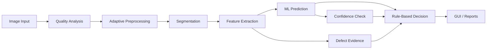

# Fruit Quality Inspection and Export Suitability Assessment


## Traditional Image Processing + Machine Learning

This project is a university final-project proof of concept for inspecting fruit images, predicting fruit type and freshness, and assigning an academic export-suitability decision. It uses manually implemented NumPy-based image processing, handcrafted visual features, classical machine learning, confidence handling, and a Tkinter dashboard for demonstration and oral defense.

## Project Highlights

- NumPy-based traditional image-processing pipeline.
- PIL image loading and conversion to NumPy arrays.
- Manual preprocessing, thresholding, morphology, and connected components.
- Handcrafted shape, color, texture, grayscale, and defect-evidence features.
- Classical ML models: KNN, SVM, and Random Forest.
- Two prediction targets: `fruit_type` and `quality`.
- Export/Domestic/Need Recheck/Reject decision layer.
- Confidence-aware prediction and model-evidence consistency checks.
- Tkinter/ttk GUI dashboard for interactive demonstration.
- End-to-end evaluation over the sampled test dataset.

## Demo / GUI Preview

<!-- Add GUI screenshot here -->

The repository also saves prediction and processing visualizations under `outputs/figures/` when relevant commands are run.

## Problem Statement

Fruit quality inspection supports sorting, market grading, and export suitability decisions. Manual inspection can be subjective because results depend on lighting, viewpoint, experience, and tolerance for visual defects.

This project demonstrates an explainable computer vision approach. Instead of using deep learning, it applies traditional image processing to detect the fruit region, extract interpretable visual evidence, and combine machine-learning predictions with rule-based grading logic.

## Objectives

- Detect the visible fruit region from an input image.
- Extract interpretable visual features from the segmented fruit.
- Classify fruit type as `apple`, `banana`, or `orange`.
- Classify quality as `fresh` or `rotten`.
- Estimate defect evidence using rule-based image analysis.
- Provide a final market decision for academic export-suitability assessment.
- Provide GUI views and reports for demonstration, testing, and oral defense.

## Technology Stack

| Category | Tool | Purpose |
|---|---|---|
| Language | Python | Main implementation language |
| Numeric processing | NumPy | Manual image-processing algorithms and feature calculations |
| Image I/O | PIL / Pillow | Load, convert, resize, and save images |
| Visualization | matplotlib | Save processing, prediction, and evaluation figures |
| Machine learning | scikit-learn | Train and evaluate KNN, SVM, and Random Forest models |
| GUI | Tkinter / ttk | Desktop demonstration dashboard |
| Testing | pytest | Automated regression and pipeline tests |

## Project Constraints

This project is intentionally framed as a traditional image-processing and classical machine-learning proof of concept.

- No OpenCV image-processing functions are used.
- No deep learning models are used.
- No `scipy` or `scikit-image` image-processing functions are used.
- Core algorithms are implemented manually with NumPy where possible.
- PIL is used for image I/O and basic file handling.
- scikit-learn is used only for the machine-learning stage.

## System Pipeline

The full system converts an input image into visual evidence, ML predictions, and a final grading decision.



| Stage | Explanation |
|---|---|
| Image loading | PIL loads the image and the pipeline converts it into NumPy arrays. |
| Quality analysis | The system estimates brightness, contrast, and noise before processing. |
| Adaptive preprocessing | Enhancement or smoothing choices are adjusted based on image quality. |
| Segmentation | Thresholding, morphology, and connected components isolate the fruit mask. |
| Feature extraction | Shape, color, texture, grayscale, and defect features are calculated from the mask. |
| Machine learning | Classical models predict fruit type and quality from handcrafted features. |
| Export rules | Rule-based logic combines predictions, confidence, and defect evidence into a market decision. |
| Consistency check | Low-confidence or conflicting model/evidence cases are moved toward `Need Recheck`. |
| GUI | Tkinter displays the image, mask, defect map, prediction, confidence, grade, and explanation. |

## Folder Structure

```text
fruit-quality-export-inspection/
├── data/                 # Raw and sampled train/test datasets
├── models/               # Saved ML models and metadata
├── outputs/              # Features, figures, masks, and generated reports
├── reports/              # Project notes and defense-oriented documentation
├── scripts/              # Helper scripts
├── src/                  # Main source modules
├── tests/                # pytest test suite
├── main.py               # Command-line entry point and GUI launcher
├── requirements.txt      # Python dependencies
└── README.md             # Project documentation
```

## Installation

Run these commands in Windows PowerShell from the project root:

```powershell
python -m venv .venv
.\.venv\Scripts\Activate.ps1
pip install -r requirements.txt
```

If PowerShell blocks virtual-environment activation, enable script execution for the current user or activate the environment from another terminal.

## Dataset Layout

The sampled dataset is expected to use class folders under `data/sample/train/` and `data/sample/test/`.

```text
data/sample/
├── train/
│   ├── freshapples/
│   ├── freshbanana/
│   ├── freshoranges/
│   ├── rottenapples/
│   ├── rottenbanana/
│   └── rottenoranges/
└── test/
    ├── freshapples/
    ├── freshbanana/
    ├── freshoranges/
    ├── rottenapples/
    ├── rottenbanana/
    └── rottenoranges/
```

The folder name provides both labels: fruit type (`apple`, `banana`, `orange`) and quality (`fresh`, `rotten`).

## How to Run

Run all commands from the project root. In Windows PowerShell, wrap image paths containing spaces in quotes.

### Run tests

```powershell
python -m pytest -q
```

### Export features

```powershell
python main.py --export-features
```

### Train models

```powershell
python main.py --train-models
```

### Predict one image

```powershell
python main.py --predict-image "path/to/image.jpg"
```

Example with a path containing spaces:

```powershell
python main.py --predict-image "data/sample/test/freshapples/example image.jpg"
```

### Evaluate system

```powershell
python main.py --evaluate-system
```

### Fast evaluation

```powershell
python main.py --evaluate-system --eval-max-per-class 5
```

### Launch GUI

```powershell
python main.py --gui
```

## Features Extracted

| Feature Group | Examples | Purpose |
|---|---|---|
| Shape | `area`, `perimeter`, `circularity`, `aspect_ratio`, `mask_area_ratio` | Describe fruit size, contour, and segmentation reliability. |
| Color | Mean RGB, RGB histogram bins, red/yellow/orange/green/brown ratios | Capture fruit color and color categories related to ripeness or defects. |
| Texture / gray | `brightness`, `contrast`, `noise_level`, gradient statistics | Describe grayscale appearance, lighting quality, and local intensity variation. |
| Defect | `defect_area`, `defect_ratio`, defect map evidence | Estimate visible damaged or abnormal regions inside the fruit mask. |

These features are handcrafted and interpretable, which makes them suitable for explaining the pipeline during project defense.

## Machine Learning

The machine-learning stage trains separate classifiers for two targets:

| Target | Classes |
|---|---|
| `fruit_type` | `apple`, `banana`, `orange` |
| `quality` | `fresh`, `rotten` |

The project compares KNN, SVM, and Random Forest models. The saved best model is selected using macro F1 and accuracy on the project dataset. Prediction confidence is also used by the decision layer so uncertain cases can be marked for manual review instead of being treated as fully reliable automatic decisions.

## Decision Logic

The final market output is a rule-based decision built from model predictions, confidence scores, defect evidence, segmentation indicators, and image-quality indicators.

| Output | Meaning |
|---|---|
| `Export Grade` | The fruit is predicted fresh with low defect evidence and acceptable inspection conditions. |
| `Domestic Grade` | The fruit may still be usable but does not satisfy stricter export-oriented rules. |
| `Need Recheck` | The system found uncertainty, medium evidence, poor image conditions, or model/evidence conflict. |
| `Reject` | The fruit has strong rejection evidence, such as rotten prediction or high defect ratio. |

`Need Recheck` is an intentional safety mechanism. It is used when confidence is low, when image quality is unreliable, or when the model output conflicts with visible evidence. The consistency check helps prevent overconfident rejection when the model predicts `rotten` but visible defect evidence is very low.

## Evaluation Results

The results below are project- and dataset-specific. They should not be interpreted as universal fruit-inspection performance or official export-certification accuracy.

| Evaluation Source | Scope | Fruit Type Accuracy | Quality Accuracy | Notes |
|---|---:|---:|---:|---|
| `outputs/reports/ml_evaluation_report.txt` | Feature-based ML evaluation | 0.9467 | 0.9600 | Best fruit-type model: Random Forest. Best quality score is shared by Random Forest and SVM in the report. |
| `outputs/reports/end_to_end_evaluation_report.txt` | Full prediction pipeline on 300 test images | 0.9500 | 0.9400 | 300 successful images, 0 failed images. |

Additional end-to-end report details:

| Metric | Value |
|---|---:|
| Total images tested | 300 |
| Successful images | 300 |
| Failed images | 0 |
| Export Grade decisions | 28 |
| Domestic Grade decisions | 98 |
| Reject decisions | 174 |

A previously sampled end-to-end evaluation was observed around 0.97 fruit-type accuracy and 0.93 quality accuracy. The full system report currently available in `outputs/reports/end_to_end_evaluation_report.txt` reports 0.95 fruit-type accuracy and 0.94 quality accuracy.

## GUI Demo Notes

The Tkinter GUI is designed for project demonstration and oral defense.

Typical demo flow:

1. Launch the GUI with `python main.py --gui`.
2. Load a fruit image.
3. Run analysis.
4. View the original image, segmentation mask, and defect map.
5. Read the predicted fruit type, quality, confidence, market grade, and explanation.
6. Explain `Need Recheck` as a safety mechanism for uncertain or conflicting evidence.

## Current Limitations

- The system supports only apple, banana, and orange classes.
- Quality classification is mainly limited to `fresh` and `rotten`.
- The pipeline works best when one visible fruit dominates the image.
- Complex backgrounds can affect thresholding and segmentation.
- External images may cause domain shift because lighting, camera, background, and fruit appearance can differ from the sampled dataset.
- The defect map is rule-based visual evidence, not pixel-level ground truth.
- Export grading is an academic proof of concept, not official export certification.
- The GUI is built for demonstration, not industrial deployment.

## Future Improvements

- Add more fruit classes and quality categories.
- Collect more real-world images across lighting, camera, background, and maturity conditions.
- Use a controlled lighting and camera setup for repeatable inspection.
- Build a conveyor-belt dataset with consistent viewpoints and motion conditions.
- Add real-time camera input.
- Add batch logging for inspection history and traceability.
- Create ground-truth segmentation masks and evaluate IoU.
- Compare the traditional pipeline with optional deep-learning baselines in future work.

## Defense Questions

| Question | Concise Answer |
|---|---|
| Why traditional image processing? | It keeps the pipeline explainable and shows each computer-vision step explicitly for academic assessment. |
| Why not OpenCV? | The project constraint is to implement core algorithms manually with NumPy instead of relying on library image-processing functions. |
| Why adaptive preprocessing? | Image quality varies, so brightness, contrast, and noise estimates help choose more suitable preprocessing steps. |
| How does Otsu thresholding work? | It searches for a threshold that separates pixel intensities into two groups with strong between-class separation. |
| Why morphology and connected components? | Morphology cleans the binary mask, while connected components help identify the main fruit region. |
| What features are extracted? | The system extracts shape, color, texture/grayscale, and defect-evidence features from the fruit mask. |
| Why KNN, SVM, and Random Forest? | They are classical ML models that work well with tabular handcrafted features and are easier to explain than deep models. |
| Why confidence scores? | Confidence helps the system avoid treating uncertain predictions as fully reliable decisions. |
| Why `Need Recheck`? | It flags cases where automatic grading may be unsafe because of low confidence, poor image quality, or conflicting evidence. |
| Why can external images fail? | External images may have different lighting, backgrounds, cameras, fruit sizes, or defect patterns from the training data. |
| How to improve for conveyor-belt deployment? | Use controlled lighting, fixed camera geometry, a conveyor-specific dataset, real-time capture, and stronger validation. |

## References / Similar Projects

These repositories are related examples of fruit inspection or fruit quality classification work. They are listed for comparison and context, not as copied implementation sources.

| Project | Relation |
|---|---|
| [RiccardoSpolaor/Fruit-Inspection](https://github.com/RiccardoSpolaor/Fruit-Inspection) | Similar fruit-inspection theme using computer vision concepts. |
| [awojidetola/Fruit-Quality-Classification](https://github.com/awojidetola/Fruit-Quality-Classification) | Related fruit-quality classification project for comparison. |
| [sanggusti/final_bangkit](https://github.com/sanggusti/final_bangkit) | Related academic-style fruit or food-quality classification work. |
| [spygeorgoulas/fruit-quality](https://github.com/spygeorgoulas/fruit-quality) | Similar fruit-quality repository useful for portfolio context. |

## Academic Framing

This repository should be presented as an explainable traditional image-processing and machine-learning prototype. It demonstrates the full path from image loading to segmentation, feature extraction, ML prediction, grading, GUI presentation, and evaluation, while keeping limitations explicit and avoiding industrial certification claims.
